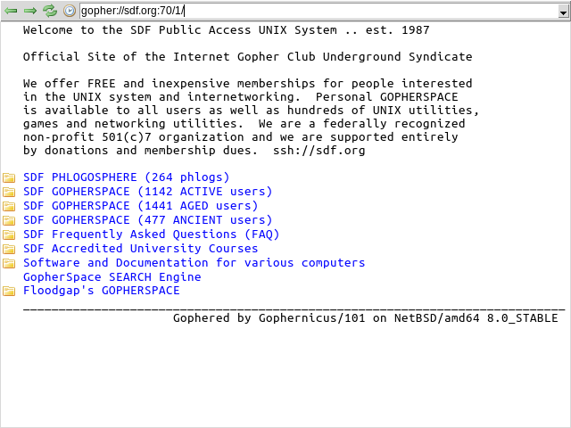

# guipher

> A Gopher client written in Guile scheme and using Tk for its GUI

guipher is still very much buggy - the [PS/Tk][PSTK] library has some issues, especially where it comes to dialogs - producing copious debug output, while being unable to be controlled via the keyboard, but it is somewhat functional.

Or, at the very least, it can be pointed at a well-formed gopher directory without it immediately having a meltdown.  A good browsing experience is not guaranteed - at the very least, it doesn't have any kind of cache - and it might just decide to crash later.

[PSTK]: https://sourceforge.net/projects/pstk/

I originally developed it using [RCS][RCS] for version control, but then imported it into git using the [rcs-fast-export][rcs-fast-export] script.

[RCS]: https://www.gnu.org/software/rcs/
[rcs-fast-export]: http://git.oblomov.eu/rcs-fast-export

The icons in the `assets/` folder come from the [Silk icon set][silk], by [Mark James](http://www.famfamfam.com/) and are used under the terms of the [CC-BY-3.0](https://creativecommons.org/licenses/by/3.0/) license.

[silk]: http://www.famfamfam.com/lab/icons/silk/
